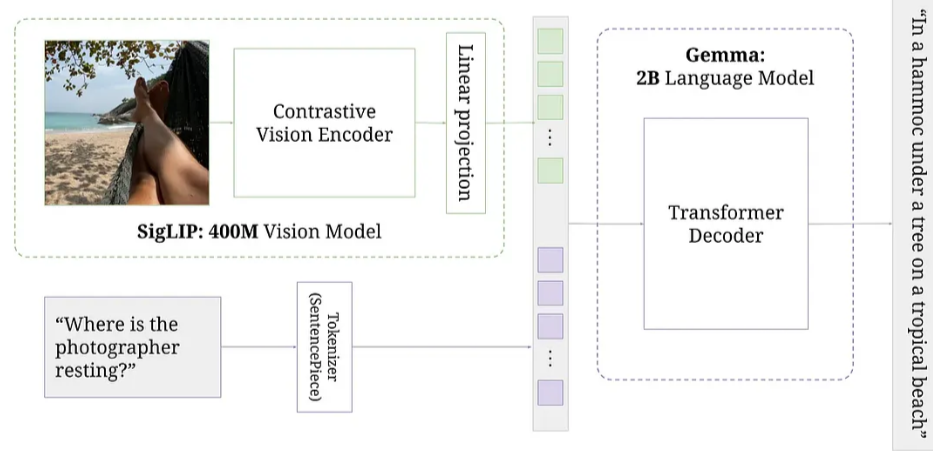

# nanoPaliGemma

## 📖 Overview

This repository contains a faithful, **from-scratch implementation** of Google's **PaliGemma** Vision-Language Model (VLM) using PyTorch.

PaliGemma is a lightweight open VLM inspired by PaLI-3. It combines a **SigLIP** vision encoder with the **Gemma** language model. This project reconstructs the model architecture layer-by-layer, including the multi-modal projector and the attention mechanisms, offering a transparent look into how modern VLMs process visual and textual tokens simultaneously.

### ✨ Key Features

* **Zero Abstraction:** No HuggingFace `AutoModel` wrappers. All model components (Encoder, Projector, Decoder) are explicitly defined.
* **Architectural Clarity:** Clean modular separation between the Vision Transformer (ViT) and the Causal Decoder (LLM).
* **Educational Focus:** Heavy commenting on tensor shapes `(Batch, Seq, Dim)` throughout the forward pass to demystify broadcasting and merging strategies.

---

## 🧠 Technical Architecture

The architecture processes inputs in three distinct stages:

### 1. SigLIP Encoder (Vision Tower)
The process begins with the **SigLIP** (Sigmoid Loss for Language Image Pre-Training) vision model, specifically the `SiglipVisionModel`.

* **Input Processing:** The raw input image is resized (224x224) and then normalized.

* **Patching:** The image is divided into fixed-size patches (14x14). Each patch is projected into a dense vector (embedding).

* **Positional Embedding:** Positional embeddings are added to these patch embeddings to retain positional information.

* **Transformer Layers:** The embeddings pass through a standard Transformer Encoder stack. This includes Multi-Head Self-Attention (MHSA) and Feed-Forward Networks (FFN) with Layer Normalization.

* **Output:** The result is a sequence of high-dimensional image feature vectors, representing the visual semantic content of the image.

### 2. Multi-Modal Projector
This component acts as the "bridge" or "connector" between the vision tower and the language model. Because the dimension of the SigLIP output (e.g., 1152) differs from the embedding dimension expected by the Gemma decoder (e.g., 2048), a projection is necessary.

* **Linear Projection:** The architecture typically uses a simple Linear layer to map the image features into the text embedding space.

* **Dimension Mapping:** Specifically, it transforms the shape from [batch_size, num_patches, vision_hidden_size] to [batch_size, num_patches, text_hidden_size].

* **Result:** The image features are now mathematically compatible with the text tokens, effectively treating image patches as "visual tokens."

### 3. Gemma Decoder (Text Generation)
The final stage utilizes the Gemma Causal Language Model, a decoder-only Transformer.

* **Input Fusion:** The projected image tokens are concatenated with the text input tokens (e.g., the prompt). The sequence order is typically [Image Tokens, Text Tokens].

* **Embedding & Normalization:** The text tokens are passed through the model's embedding layer. The combined sequence (image + text embeddings) is normalized.

* **Grouped Query Attention (GQA):** The decoder utilizes **Grouped Query Attention**, an optimized version of standard attention that speeds up inference by sharing Key/Value heads.

* **KV Caching:** For efficient autoregressive generation, Key and Value states are cached.

* **Logits & Generation:** The output of the final layer is projected to the vocabulary size to produce logits. The model then samples the next token iteratively until an `<eos>` token is generated or the max length is reached.

|  |
*PaliGemma Architecture*

---

## 🛠️ Installation

Follow these steps to set up the environment and prepare the model for inference.

### 1. Clone the Repository

```bash
git clone https://github.com/sahilX7/nanoPaliGemma.git
cd nanoPaliGemma

```

### 2. Environment Setup

It is strictly recommended to use a virtual environment to avoid dependency conflicts.

```bash
# Create virtual environment
python -m venv venv

# Activate (Windows)
venv\Scripts\activate

# Activate (macOS/Linux)
source venv/bin/activate

```

### 3. Install Dependencies

```bash
pip install -r requirements.txt

```

> **Note:** Ensure you have `torch` installed with CUDA/MPS support if you intend to run this on a GPU/Mac accelerator.
>

### 4. Download Model Weights
> **⚠️ Important: The model weights are not included in this repository due to size constraints. You must download them manually.**

1. **Download:** Get the pre-trained weights from Kaggle:
   **[Download Link](https://www.kaggle.com/datasets/ajax0564/paligemma-3b-pt-224/suggestions)**

2. **Setup Directory:** Create a `weights` folder in the project root and move the **downloaded files** there.

---

## 🚀 Usage

### 1. Prepare Data

Download any image you wish to test and place it in the `test_images` folder

### 2. Configuration

Open `main.py` to configure your input paths and generation parameters.

```python
# main.py constants
MODEL_PATH = "weights"
IMAGE_PATH = "test_images/cat.jpg"
MAX_TOKENS_TO_GENERATE = 100
ONLY_CPU = False
```

### 3. Run Inference

Execute the main script. The code handles the image preprocessing (normalization/resizing) and tokenization automatically.

```bash
python main.py
```

### 4. Expected Output

You will see an `Ask anything` prompt in your terminal. Enter your text prompt about the image to generate a response. The model will process the image embeddings, concatenate them with your text prompt, and autoregressively generate a response.

```
Ask anything:
describe this image

Device in use: cpu
Loading model...
Running inference...

--------------------------------------------------
USER: describe this image
ASSISTANT: Cat raising its paw
```

---

## 📂 Project Structure

```
nanoPaliGemma/
├── paligemma/
│   ├── core/
│   │   └── paligemma.py           # Defines the core PaliGemma architecture
│   ├── inference/
│   │   └── inference.py           # Contains the inference loop and generation logic
│   ├── models/
│   │   ├── gemma.py               # Gemma language model implementation
│   │   └── siglip.py              # SigLIP vision encoder implementation
│   ├── processor/
│   │   └── paligemma_processor.py # Handles input data processing 
│   └── utils/
│       └── utils.py               # Utilities to load tokenizer and PaliGemma weights into the architecture
├── assets/                        # Assets
├── test_images/                   # Directory for input images
├── venv/                          # Virtual environment
├── weights/                       # Place downloaded model weights here (Excluded from git)
├── main.py                        # Entry point for the application
└── requirements.txt               # Python dependencies
└── README.md                      # Project documentation

```

---

## ⚠️ Limitations

* **Inference Only:** This repository currently supports forward pass (inference). Backpropagation (training) logic is not yet implemented.
* **Single Image:** The current processor implementation supports single-image prompts.
---

## 📜 Acknowledgements

* **Research:** Based on *PaliGemma: A Versatile 3B VLM for Transfer* by Google DeepMind.
* **References:** Architecture logic inspired by the official [PaliGemma](https://github.com/huggingface/transformers/tree/main/src/transformers/models/paligemma), [SigLIP](https://github.com/huggingface/transformers/tree/main/src/transformers/models/siglip) and [Gemma](https://github.com/huggingface/transformers/tree/main/src/transformers/models/gemma) implementations.